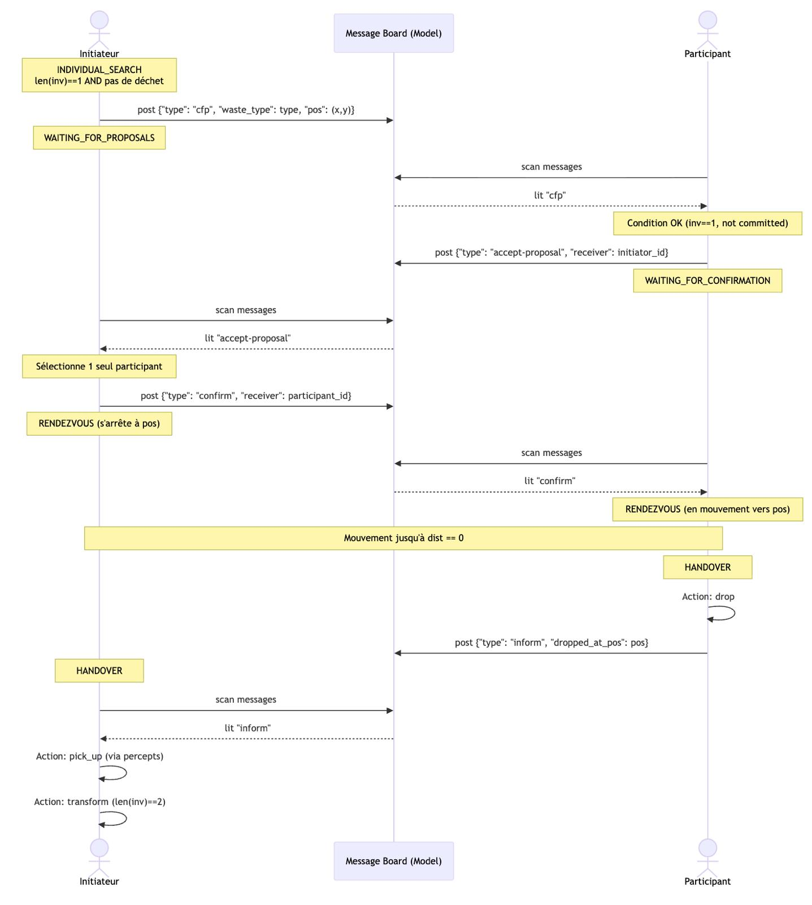

# Self-Organization of Robots in a Hostile Environment

> **Groupe 5** — Maxence Rossignol, Antoine Yezou, Daphné Maschas  
> Systèmes Multi-Agents — 2026

## 1. Présentation du Projet

Ce projet simule une mission de gestion de déchets radioactifs par une flotte d'agents autonomes. L'objectif est d'évacuer la radioactivité d'un environnement divisé en zones de danger croissant en transformant et en déplaçant des déchets vers une zone de stockage sécurisée.

Le système repose sur :
- [Mesa 3.x](https://mesa.readthedocs.io/) — framework de simulation multi-agents en Python.
- [Solara](https://solara.dev/) — interface web interactive pour la visualisation en temps réel.
- [Matplotlib](https://matplotlib.org/) — rendu graphique de la grille et des courbes de suivi.

## 2. Configuration de l'Environnement

### Grille et Zones

L'espace est une grille `MultiGrid` de 15×10 cellules (non-torique) décomposée en trois zones d'ouest en est :

| Zone | Colonnes | Radioactivité | Contenu initial |
|------|----------|---------------|-----------------|
| $Z_1$ | 0 – 4 | Faible (0 – 0.33) | Déchets verts |
| $Z_2$ | 5 – 9 | Moyenne (0.33 – 0.66) | Déchets jaunes |
| $Z_3$ | 10 – 14 | Haute (0.66 – 1.0) | Déchets rouges + Waste Disposal Zone |

Chaque cellule possède un objet `RadioactivitySource` qui encode sa zone et son niveau de radioactivité (tiré uniformément dans l'intervalle de la zone). La **Waste Disposal Zone** est placée aléatoirement sur la colonne la plus à l'est (x = 14).

### État Initial

Le nombre de déchets de chaque type est configurable via l'interface (15 par défaut). Les déchets sont répartis aléatoirement dans leur zone respective :
- $N$ déchets **verts** dans $Z_1$ (valeur radioactive : 1)
- $N$ déchets **jaunes** dans $Z_2$ (valeur radioactive : 2)
- $N$ déchets **rouges** dans $Z_3$ (valeur radioactive : 4)

## 3. Architecture des Agents

### Cycle Perception–Délibération–Action

Chaque robot suit un cycle BDI simplifié à chaque step :

1. **Perception** — Le modèle renvoie les percepts du voisinage de Moore (8 cases + case courante). Chaque percept contient le type d'objet, son identifiant unique, et des détails (type de déchet, niveau de radioactivité, zone).
2. **Délibération** — L'agent évalue ses règles de priorité (voir ci-dessous) pour choisir une action.
3. **Action** — Le modèle vérifie la validité de l'action et l'exécute (`move`, `pick_up`, `transform`, `drop`, `post_message`).

### Connaissances de l'Agent

Chaque robot maintient un dictionnaire `knowledge` contenant :
- `inventory` — liste des déchets transportés.
- `last_percepts` — dernière observation du voisinage.

## 4. Protocole et Règles des Robots

### Robot Vert (`GreenAgent`)

| Propriété | Valeur |
|-----------|--------|
| Zone d'évolution | $Z_1$ uniquement |
| Capacité d'inventaire | 2 déchets verts |
| Transformation | 2 verts → 1 jaune |
| Livraison | Frontière est de $Z_1$ (colonne 4) |

**Logique de délibération (par ordre de priorité) :**
1. Si l'inventaire contient 2 déchets verts → **transformer**.
2. Si l'inventaire contient 1 déchet jaune (issu d'une transformation) → **se déplacer vers la frontière est** de $Z_1$, puis **déposer** et publier un message `waste_ready`.
3. Si un déchet vert est sur la case courante et l'inventaire n'est pas plein → **ramasser**.
4. Si un déchet vert est visible dans le voisinage → **se déplacer** vers lui.
5. Sinon → **explorer** aléatoirement dans $Z_1$.

### Robot Jaune (`YellowAgent`)

| Propriété | Valeur |
|-----------|--------|
| Zone d'évolution | $Z_1$ et $Z_2$ |
| Capacité d'inventaire | 2 déchets jaunes |
| Transformation | 2 jaunes → 1 rouge |
| Livraison | Frontière est de $Z_2$ (colonne 9) |

**Logique de délibération (par ordre de priorité) :**
1. Si l'inventaire contient 2 déchets jaunes → **transformer**.
2. Si l'inventaire contient 1 déchet rouge → **se déplacer vers la frontière est** de $Z_2$, puis **déposer** et publier un message `waste_ready`.
3. Si un déchet jaune est sur la case courante et l'inventaire n'est pas plein → **ramasser**.
4. Si un déchet jaune est visible dans le voisinage → **se déplacer** vers lui.
5. Mode patrouille (optionnel) → **longer la frontière** $Z_1$/$Z_2$ en attendant des déchets jaunes déposés par les robots verts.
6. Sinon → **explorer** aléatoirement dans $Z_2$.

### Robot Rouge (`RedAgent`)

| Propriété | Valeur |
|-----------|--------|
| Zone d'évolution | $Z_1$, $Z_2$ et $Z_3$ (accès total) |
| Capacité d'inventaire | 1 déchet rouge |
| Transformation | Aucune |
| Livraison | Waste Disposal Zone (colonne 14) |

**Logique de délibération (par ordre de priorité) :**
1. Si l'inventaire contient un déchet rouge :
   - Si la Waste Disposal Zone est visible → **se déplacer** vers elle puis **déposer**.
   - Sinon → **se diriger vers l'est** (colonne 14) puis effectuer un **balayage vertical** (haut/bas) pour localiser la zone de dépôt.
2. Si un déchet rouge est sur la case courante → **ramasser**.
3. Si un déchet rouge est visible dans le voisinage → **se déplacer** vers lui.
4. Mode patrouille (optionnel) → **longer la frontière** $Z_2$/$Z_3$ en attendant des déchets rouges déposés par les robots jaunes.
5. Sinon → **explorer** aléatoirement dans $Z_3$.

## 5. Protocole de Communication

Les robots communiquent via un **tableau de messages partagé** (`message_board`) géré par le modèle. Ce protocole s'inspire du **Contract Net Protocol (CNP)** et permet aux robots d'une même couleur de coopérer lorsqu'ils ne trouvent plus de déchets individuellement.

### Diagramme de Séquence



### Étapes du Protocole

Le protocole se déroule entre un **initiateur** (robot possédant 1 déchet et ne trouvant plus de déchet à proximité) et un **participant** (robot de même couleur dans la même situation) :

1. **Appel à propositions (CFP)** — L'initiateur publie un message `{"type": "cfp", "waste_type": <type>, "pos": (x, y)}` sur le tableau de messages et passe en état `WAITING_FOR_PROPOSALS`.

2. **Acceptation** — Un participant scanne les messages, lit le CFP, vérifie qu'il est éligible (`inv == 1`, non engagé), puis répond avec `{"type": "accept-proposal", "receiver": initiator_id}`. Il passe en état `WAITING_FOR_CONFIRMATION`.

3. **Confirmation** — L'initiateur lit les propositions, sélectionne un seul participant, et publie `{"type": "confirm", "receiver": participant_id}`.

4. **Rendez-vous** — Les deux robots convergent vers la position de l'initiateur :
   - L'initiateur s'arrête à sa position et attend.
   - Le participant se déplace vers la position indiquée jusqu'à ce que la distance soit nulle.

5. **Handover (transfert)** — Le participant dépose son déchet (`drop`) et publie `{"type": "inform", "dropped_at_pos": pos}`.

6. **Collecte et transformation** — L'initiateur lit le message `inform`, ramasse le déchet déposé via ses percepts (`pick_up`), puis déclenche la transformation lorsque son inventaire atteint 2 (`transform`).

Ce mécanisme permet d'éviter les situations de blocage où deux robots possèdent chacun un seul déchet sans en trouver d'autre à proximité.

## 6. Objectif Global et Métriques

L'objectif est d'optimiser l'organisation collective pour **minimiser l'impact radioactif cumulé** durant la mission.

### Calcul de la Radioactivité Totale

À chaque step, la radioactivité totale $R$ est calculée en sommant les contributions de tous les déchets encore en jeu (sur la grille **et** dans les inventaires des robots) :

$$R_{total} = (1 \times N_{verts}) + (2 \times N_{jaunes}) + (4 \times N_{rouges})$$

Un déchet déposé dans la Waste Disposal Zone est retiré de la simulation et ne contribue plus à $R_{total}$.

### Analyse de Performance

La performance d'une stratégie est évaluée par la **minimisation de l'aire sous la courbe (AUC)** de $R_{total}$ en fonction du temps :
- **Axe X :** Temps (steps)
- **Axe Y :** $R_{total}$
- **Critère de succès :** Plus l'AUC est faible, plus le système a réduit rapidement le danger global.

### Données Collectées

Le `DataCollector` de Mesa enregistre à chaque step :
| Métrique | Description |
|----------|-------------|
| `Green_Waste` | Nombre de déchets verts (grille + inventaires) |
| `Yellow_Waste` | Nombre de déchets jaunes (grille + inventaires) |
| `Red_Waste` | Nombre de déchets rouges (grille + inventaires) |
| `Total_Radioactivity` | $R_{total}$ |
| `Messages` | Nombre de messages sur le tableau de bord |

Les données sont exportées en CSV dans `data/` tous les 50 steps, ainsi qu'à la fin de la simulation (`data/final_results.csv`).

## 7. Structure du Projet

```
.
├── run.py                          # Point d'entrée — lance le serveur Solara
├── check_start.py                  # Vérifie que le serveur Solara démarre correctement
├── test_logic.py                   # Test de la logique de collecte/transformation
├── pyproject.toml                  # Dépendances (gérées par uv)
├── 5_robot_mission_MAS2026/
│   ├── model.py                    # Modèle RobotMission (grille, règles, collecte de données)
│   ├── agents.py                   # Agents (GreenAgent, YellowAgent, RedAgent)
│   ├── objects.py                  # Objets passifs (Waste, RadioactivitySource, WasteDisposalZone)
│   └── server.py                   # Visualisation Solara (rendu grille + graphiques)
├── images/
│   └── interactions.jpeg           # Diagramme de séquence du protocole de communication
└── data/                           # Logs CSV générés pendant la simulation
```

## 8. Installation et Exécution

### Prérequis
- Python >= 3.13
- [uv](https://docs.astral.sh/uv/) (gestionnaire de paquets)

### Lancement
```bash
git clone <url-du-dépôt>
cd Self-Organization-of-Robots-in-a-Hostile-Environnement
uv sync
python run.py
```

Le serveur Solara démarre et ouvre une interface web interactive permettant de :
- **Configurer les paramètres** : nombre de robots (vert, jaune, rouge) et de déchets initiaux via des sliders.
- **Visualiser la grille** en temps réel : zones colorées (vert clair / orange clair / rouge clair), robots (cercles colorés), déchets (petits carrés) et zone de dépôt (croix bleue).
- **Suivre les métriques** via deux graphiques temps réel :
  - Stocks de déchets par type (vert, jaune, rouge).
  - Radioactivité totale.

### Tests

```bash
python test_logic.py
```

Lance une simulation headless de 20 steps avec 3 robots verts et 15 déchets verts, et vérifie qu'au moins une transformation (vert → jaune) a lieu.
